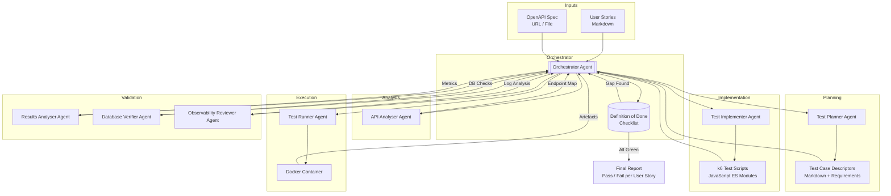
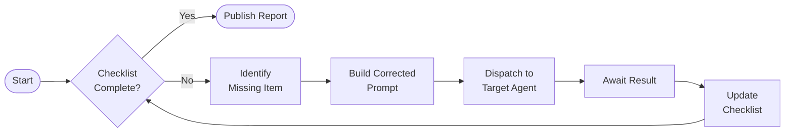
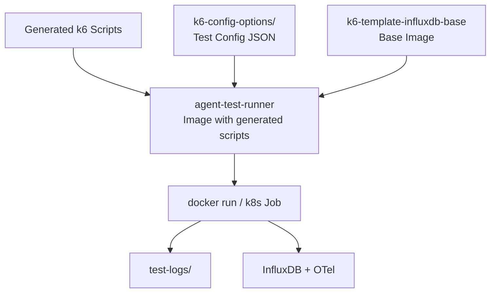
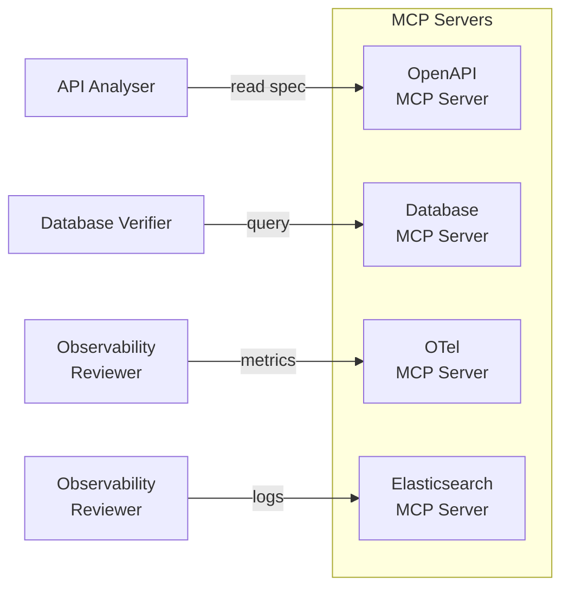
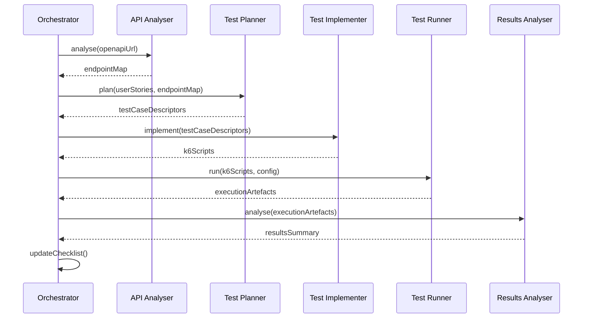

# WP-12 — AI Agent-Driven Test Automation

> **Status**: Draft · **Phase**: 5 — AI-Driven Testing
>
> Design plan for an autonomous, multi-agent system that generates, executes,
> and validates k6 performance tests from user stories and OpenAPI
> specifications.

---

## 1  Problem

Today every k6 test is written by hand. A developer must:

1. Read a user story or requirement.
2. Inspect the target API (Swagger / OpenAPI).
3. Write the k6 test script manually.
4. Run the test inside a Docker container.
5. Interpret results, check databases, and review logs.

This is slow, error-prone, and does not scale across many services.

## 2  Goal

Replace the manual loop with a **team of cooperating AI agents** — each
packaged as an independent module inside this repository — that can:

- Parse an OpenAPI specification automatically.
- Generate k6 test cases from product-manager user stories.
- Execute the tests inside isolated containers.
- Analyse results, database state, and observability data.
- Produce a traceable report linking every result back to its requirement.

The system must be **production-ready**: any company can point it at their own
API and get a full performance-test suite without writing code.

## 3  Agent Roles

Eight agents, each with a single responsibility:

<!-- markdownlint-disable MD013 -->

| # | Agent | Responsibility | MCP Connections |
|---|-------|---------------|-----------------|
| 1 | **Orchestrator** | Coordinates all agents, maintains a Definition of Done checklist, retries failed steps with corrected prompts | All other agents |
| 2 | **API Analyser** | Discovers endpoints, schemas, and auth requirements from Swagger / OpenAPI specs | OpenAPI MCP server |
| 3 | **Test Planner** | Converts user stories + API analysis into test case descriptors (markdown with requirements traceability) | — |
| 4 | **Test Implementer** | Generates k6 JavaScript test scripts from test case descriptors using `src/` shared libraries | — |
| 5 | **Test Runner** | Builds the container image, executes the k6 run, collects exit code and artefacts | Docker / k8s API |
| 6 | **Results Analyser** | Parses k6 JSON/CSV output, evaluates thresholds, produces a pass/fail summary | InfluxDB MCP server |
| 7 | **Database Verifier** | Queries the service's own database (Postgres, MongoDB, etc.) to confirm that API side-effects match the user story | Database MCP servers |
| 8 | **Observability Reviewer** | Pulls OpenTelemetry metrics and Elasticsearch logs, flags anomalies (error spikes, latency regressions) | OTel Collector, Elasticsearch MCP servers |

<!-- markdownlint-enable MD013 -->

## 4  Architecture Flow

### 4.1  High-Level Pipeline



### 4.2  Orchestrator Retry Loop



### 4.3  Container Build Pipeline



## 5  Package Structure

Each agent is a self-contained package under `agents/` so it can be developed,
tested, and versioned independently. At deployment time all packages are
composed into a single orchestration container.

```text
agents/
├── orchestrator/
│   ├── package.json
│   ├── index.js            # Entry point
│   ├── checklist.js         # Definition of Done state machine
│   └── agent-dispatcher.js  # Sends prompts to other agents
├── api-analyser/
│   ├── package.json
│   ├── index.js
│   └── openapi-parser.js    # Swagger / OpenAPI v3 parsing
├── test-planner/
│   ├── package.json
│   ├── index.js
│   └── story-mapper.js      # User story → test case mapping
├── test-implementer/
│   ├── package.json
│   ├── index.js
│   └── script-generator.js  # k6 script code generation
├── test-runner/
│   ├── package.json
│   ├── index.js
│   └── container-builder.js # Docker / k8s job management
├── results-analyser/
│   ├── package.json
│   ├── index.js
│   └── threshold-evaluator.js
├── database-verifier/
│   ├── package.json
│   ├── index.js
│   └── query-executor.js    # Multi-DB query abstraction
└── observability-reviewer/
    ├── package.json
    ├── index.js
    └── log-analyser.js       # Elasticsearch & OTel queries
```

## 6  MCP Integration

Each agent that needs external data connects through a dedicated
**Model Context Protocol (MCP) server**.



MCP servers are configured at runtime via environment variables so the system
can point at any target service without code changes:

```text
OPENAPI_MCP_SERVER_URL=http://localhost:3100
DATABASE_MCP_SERVER_URL=http://localhost:3101
OTEL_MCP_SERVER_URL=http://localhost:3102
ELASTICSEARCH_MCP_SERVER_URL=http://localhost:3103
```

## 7  Inter-Agent Communication

Agents communicate through a shared **message bus** (in-process event emitter
for single-container deployment, replaceable with Redis Streams or NATS for
distributed deployment).



## 8  Deployment Model

```text
┌─────────────────────────────────────────────────────┐
│  Orchestration Container                            │
│                                                     │
│  ┌───────────┐  ┌────────────┐  ┌───────────────┐  │
│  │Orchestrator│  │API Analyser│  │ Test Planner  │  │
│  └───────────┘  └────────────┘  └───────────────┘  │
│  ┌───────────────┐  ┌───────────┐                   │
│  │Test Implementer│  │Results    │                   │
│  │               │  │Analyser   │                   │
│  └───────────────┘  └───────────┘                   │
│  ┌──────────────────┐  ┌──────────────────────┐     │
│  │Database Verifier │  │Observability Reviewer │     │
│  └──────────────────┘  └──────────────────────┘     │
│                                                     │
│  Message Bus (in-process EventEmitter)              │
└──────────────────┬──────────────────────────────────┘
                   │ spawns
                   ▼
┌─────────────────────────────────────────────────────┐
│  Test Runner Container(s)                           │
│  (k6-template-influxdb-base + generated scripts)    │
│  Runs k6, exports metrics to InfluxDB / OTel        │
└─────────────────────────────────────────────────────┘
```

- **Orchestration container**: Node.js process running all agent modules.
  Built from a single `agents/Dockerfile`.
- **Test runner containers**: Ephemeral, one per test execution. Built from
  the existing `k6-template-influxdb-base` image with generated scripts
  injected at runtime via volume mount or multi-stage build.

## 9  User Story → Test Case Traceability

The Test Planner produces markdown descriptors that link requirements to tests:

```markdown
## TC-001 — List all breeds

- **User Story**: US-42 "As a user I can list all dog breeds"
- **Endpoint**: `GET /api/v2/breeds`
- **Preconditions**: None
- **Steps**:
  1. Send GET request to `/api/v2/breeds`
  2. Assert HTTP 200
  3. Assert response body contains `data` array
- **Expected Results**: Response time p95 < 500 ms, status 200
- **Database Check**: `SELECT count(*) FROM breeds` matches response length
- **Tags**: `smoke`, `regression`, `US-42`
```

These descriptors are stored alongside the generated k6 scripts so that the
final report can trace every pass/fail back to the originating user story.

## 10  Definition of Done Checklist (per run)

The Orchestrator maintains the following checklist. A run is complete only when
every item is checked. If a gap is found the Orchestrator re-prompts the
responsible agent.

```text
[ ] API specification parsed — endpoint map available
[ ] Test case descriptors generated — one per user story
[ ] k6 scripts generated — one per test case descriptor
[ ] k6 scripts pass syntax validation (k6 inspect)
[ ] Container image built successfully
[ ] k6 run completed — exit code 0
[ ] Results analysed — threshold evaluation complete
[ ] Database verification passed — side-effects confirmed
[ ] Observability review passed — no anomalies detected
[ ] Final report generated — every user story mapped to a result
```

## 11  Implementation Phases

| Phase | Work | Depends On |
|-------|------|-----------|
| A | Scaffold `agents/` package structure, message bus, Orchestrator skeleton | — |
| B | API Analyser + OpenAPI MCP server | Phase A |
| C | Test Planner (user story → test case descriptors) | Phase A |
| D | Test Implementer (descriptor → k6 script generation) | Phases B, C |
| E | Test Runner (container build + k6 execution) | Phase D |
| F | Results Analyser (k6 output parsing + threshold evaluation) | Phase E |
| G | Database Verifier + Database MCP servers | Phase A |
| H | Observability Reviewer + OTel / Elasticsearch MCP servers | Phase A |
| I | End-to-end integration, final report generation | All above |

## 12  Design Decisions

1. **Single repo, multiple packages** — agents live in `agents/` as
   independent npm packages with their own `package.json`. This keeps the
   repository self-contained while allowing separate versioning.

2. **In-process message bus first** — start with a Node.js `EventEmitter`.
   Replace with Redis Streams or NATS when distributed deployment is needed,
   without changing agent code (dependency injection).

3. **Existing k6 base image** — reuse `k6-template-influxdb-base` and the
   shared `src/clients/` libraries. Generated scripts import from the same
   paths that hand-written tests use.

4. **MCP for external access** — all external I/O (OpenAPI specs, databases,
   Elasticsearch, OTel) goes through MCP servers. This provides a uniform
   interface and makes agents testable with mock MCP servers.

5. **Markdown as the interchange format** — test case descriptors, user
   stories, and the final report are all markdown. Human-readable, version
   controllable, and easy to parse programmatically.

## 13  Definition of Done (for this plan)

- [ ] Architecture reviewed and approved.
- [ ] `agents/` directory scaffolded with placeholder packages.
- [ ] Orchestrator agent can dispatch to stub agents and maintain a checklist.
- [ ] At least one end-to-end demo: user story in → k6 test executed →
      report out.
- [ ] CI updated to lint and test agent packages.
- [ ] Documentation updated (`docs/`) describing how to run the agent system.
