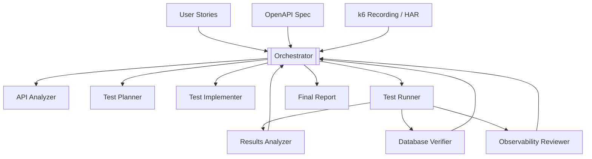

# WP-12 — AI Agent-Driven Test Automation (Master Plan)

> **Status**: Draft · **Phase**: 5 — AI-Driven Testing
>
> Master plan for an autonomous, multi-agent system that generates, executes,
> and validates k6 performance tests from user stories and OpenAPI
> specifications. Each sub-task below is a self-contained work package that
> can be implemented and merged as a single PR.

---

## Problem

Today every k6 test is written by hand. A developer must read a user story,
inspect the target API, write a k6 script, run it in a container, and
manually interpret results. This is slow and does not scale.

## Goal

Replace the manual loop with **cooperating AI agents** that can:

1. Parse an OpenAPI specification automatically.
2. Generate k6 test cases from product-manager user stories.
3. Optionally reverse-engineer test flows from k6 browser recordings / HAR.
4. Execute tests inside isolated containers.
5. Validate results against databases, metrics, and logs.
6. Produce a traceable report linking every result back to its requirement.

## High-Level Pipeline



## Technology Decisions

| Decision | Choice | Rationale |
|----------|--------|-----------|
| Agent runtime | Go CLI + TypeScript/JS test output | k6 is built on Go; Go agents share the k6 ecosystem, offer native Docker/k8s client libraries, and produce single-binary artifacts. Generated test scripts remain JS/TS for k6 compatibility. |
| Agent SDK | Evaluate Claude Agent SDK, Copilot Agent SDK, LangChain Go, or custom MCP-native agents | Pick the simplest SDK that supports MCP tool calling. Decision made in WP-12a. |
| Test input | k6 HAR recording + OpenAPI + user stories | HAR recordings let users capture real browser sessions and reverse-engineer them into k6 flows automatically. |
| Auth config | Instruction files (not hardcoded) | Each company has unique auth flows (JWT, OAuth2, API keys). Users provide auth instructions that agents follow. See WP-12j. |
| Inter-agent comms | In-process function calls first, MCP tool protocol later | Start simple. Agents call each other as Go functions. Scale to MCP tool calls when distributed. |
| RAG | Embed OpenAPI specs + user stories into vector store for agent context | Agents retrieve relevant API context per test case. Evaluated in WP-12b. |

## Sub-Task Index

Each sub-task is a separate plan file that can be implemented independently.
Implement them in the order shown (dependencies noted).

<!-- markdownlint-disable MD013 -->

| Task | File | Title | Depends On |
|------|------|-------|-----------|
| WP-12a | [wp-12a-agent-framework.md](wp-12a-agent-framework.md) | Agent Framework & SDK Foundation | — |
| WP-12b | [wp-12b-api-analyzer.md](wp-12b-api-analyzer.md) | API Analyzer Agent | WP-12a |
| WP-12c | [wp-12c-test-planner.md](wp-12c-test-planner.md) | Test Planner Agent | WP-12a |
| WP-12d | [wp-12d-test-implementer.md](wp-12d-test-implementer.md) | Test Implementer Agent | WP-12b, WP-12c |
| WP-12e | [wp-12e-test-runner.md](wp-12e-test-runner.md) | Test Runner Agent | WP-12d |
| WP-12f | [wp-12f-results-analyzer.md](wp-12f-results-analyzer.md) | Results Analyzer Agent | WP-12e |
| WP-12g | [wp-12g-database-verifier.md](wp-12g-database-verifier.md) | Database Verifier Agent | WP-12a |
| WP-12h | [wp-12h-observability-reviewer.md](wp-12h-observability-reviewer.md) | Observability Reviewer Agent | WP-12a |
| WP-12i | [wp-12i-orchestrator.md](wp-12i-orchestrator.md) | Orchestrator Agent | WP-12a |
| WP-12j | [wp-12j-auth-instructions.md](wp-12j-auth-instructions.md) | Auth Instructions Framework | WP-12a |
| WP-12k | [wp-12k-integration-deployment.md](wp-12k-integration-deployment.md) | End-to-End Integration & Deployment | All above |

<!-- markdownlint-enable MD013 -->

## Package Structure

```text
agents/
├── cmd/                    # Go CLI entry points
│   └── agent-orchestrator/ # Main binary
├── internal/               # Shared Go packages
│   ├── bus/                # Inter-agent message bus
│   ├── mcp/                # MCP client library
│   └── config/             # Auth instructions loader
├── api-analyzer/           # WP-12b
├── test-planner/           # WP-12c
├── test-implementer/       # WP-12d
├── test-runner/            # WP-12e
├── results-analyzer/       # WP-12f
├── database-verifier/      # WP-12g
├── observability-reviewer/ # WP-12h
├── orchestrator/           # WP-12i
├── auth-instructions/      # WP-12j — user-provided auth configs
├── go.mod
├── go.sum
└── Dockerfile
```

## Definition of Done (for the full WP-12)

- [ ] All sub-task plans reviewed and approved.
- [ ] Each agent package buildable and testable independently.
- [ ] Orchestrator dispatches to all agents and maintains a checklist.
- [ ] End-to-end demo: user story in → k6 test executed → report out.
- [ ] CI updated to build, lint, and test agent packages.
- [ ] Documentation updated describing how to run the agent system.
