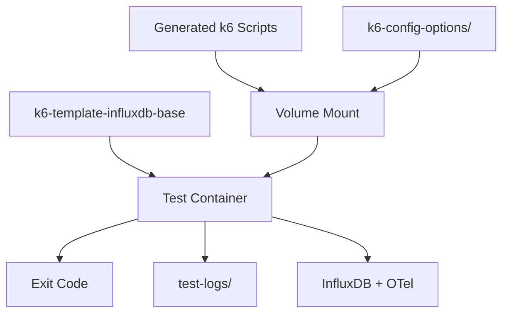

# WP-12e — Test Runner Agent

> **Status**: Draft · **Parent**: [WP-12](wp-12-ai-agent-test-automation.md)
> · **Depends on**: WP-12d

## Goal

Build an agent that takes generated k6 scripts and executes them inside
isolated Docker containers (or Kubernetes jobs), collecting all artifacts.

## Scope

- [ ] Accept generated k6 scripts and a test configuration JSON.
- [ ] Build a container image from `k6-template-influxdb-base` with the
      generated scripts injected (volume mount or multi-stage build).
- [ ] Execute `docker run` (or create a k8s Job) with proper environment
      variables, network, and volume mounts.
- [ ] Collect exit code, stdout/stderr, test-logs, and k6 JSON output.
- [ ] Support parallel execution of multiple test containers.
- [ ] Pass auth-related environment variables from auth instructions.

## Container Strategy



Two approaches — decide during implementation with a short ADR:

1. **Volume mount** (recommended for dev) — mount generated scripts into the
   base image at runtime. Simpler, no image rebuild needed.
2. **Multi-stage build** (recommended for CI/k8s) — build a new image with
   scripts baked in. Better for reproducible CI pipelines and k8s jobs.

Decision criteria: if the target is Docker Compose on a dev machine, use
volume mount. If the target is a CI pipeline or k8s cluster, use multi-stage.
Both must be supported; the CLI flag `--container-strategy=mount|build`
selects the approach.

## Environment Variables

```text
API_SERVER=target.api.host
K6_OUT=xk6-influxdb=http://influxdb:8086
K6_INFLUXDB_TOKEN=<from-auth-instructions>
K6_OTEL_GRPC_EXPORTER_ENDPOINT=otel-collector:4317
TEST_RUN_ID=<generated-uuid>
```

## Definition of Done

- [ ] Agent builds and runs a test container with a generated script.
- [ ] Exit code and logs are captured and returned.
- [ ] Works with Docker Compose network (`k6-webnet`).
- [ ] Unit tests cover container command construction.
- [ ] Integration test runs a simple k6 script end-to-end.
- [ ] `go test ./test-runner/...` passes.
