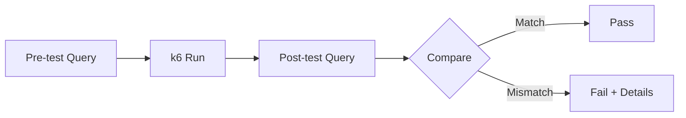

# WP-12g — Database Verifier Agent

> **Status**: Draft · **Parent**: [WP-12](wp-12-ai-agent-test-automation.md)
> · **Depends on**: WP-12a

## Goal

Build an agent that queries the target service's database to verify that
API side-effects (creates, updates, deletes) match what the user story
requires.

## Scope

- [ ] Connect to databases via a **Database MCP server** that abstracts
      the underlying engine (PostgreSQL, MongoDB, MySQL, etc.).
- [ ] Accept database check instructions from test case descriptors
      (e.g., `SELECT count(*) FROM breeds`).
- [ ] Execute queries before and after the k6 run to detect changes.
- [ ] Compare actual results against expected results from the descriptor.
- [ ] Support read-only queries only (never mutate data).

## MCP Server (Database)

```text
Tool: database.query     → executes a read-only query, returns rows/documents
Tool: database.list_tables → lists tables/collections
Tool: database.describe   → returns schema for a table/collection
```

Configured via:

```text
DATABASE_MCP_SERVER_URL=http://localhost:3102
DATABASE_TYPE=postgres|mongodb|mysql
DATABASE_CONNECTION_STRING=<from-auth-instructions>
```

## Verification Flow



## Definition of Done

- [ ] Agent executes a sample query via MCP and returns results.
- [ ] Pre/post comparison logic works for simple count checks.
- [ ] Works with at least one database type (PostgreSQL).
- [ ] Graceful skip when no database checks are defined.
- [ ] Unit tests cover comparison logic.
- [ ] `go test ./database-verifier/...` passes.
