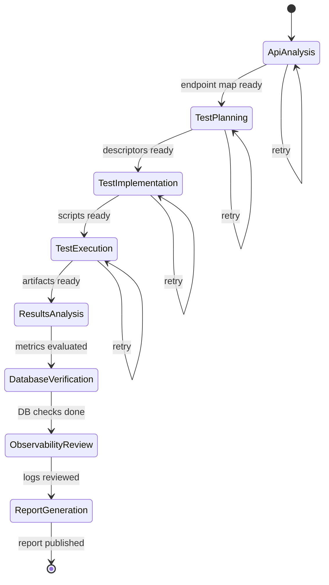

# WP-12i — Orchestrator Agent

> **Status**: Draft · **Parent**: [WP-12](wp-12-ai-agent-test-automation.md)
> · **Depends on**: WP-12a

## Goal

Build the central coordination agent that drives the entire pipeline,
maintains a Definition of Done checklist, and retries failed steps with
corrected prompts — similar to how Claude agent teams work together.

## Scope

- [ ] Accept inputs: user stories, OpenAPI spec URL/file, optional HAR file.
- [ ] Maintain a **Definition of Done checklist** (state machine).
- [ ] Dispatch tasks to other agents in the correct order.
- [ ] Inspect results from each agent and update the checklist.
- [ ] If a step fails or produces incomplete output, build a **corrected
      prompt** and re-dispatch to the responsible agent (max 3 retries).
- [ ] Produce the final report when all checklist items are green.

## Checklist State Machine



## Retry Logic

When an agent returns an error or incomplete output:

1. Orchestrator identifies what is missing.
2. Builds a new prompt that includes the error message and what was expected.
3. Re-dispatches to the same agent.
4. After 3 failures, marks the step as failed and moves to report generation.

## CLI Interface

```text
agent-orchestrator run \
  --stories ./user-stories/ \
  --openapi https://api.example.com/openapi.json \
  --har ./recordings/session.har \
  --auth-instructions ./auth-instructions.yaml \
  --output ./reports/
```

## Definition of Done

- [ ] Orchestrator dispatches to all agents in correct order.
- [ ] Checklist state machine transitions correctly.
- [ ] Retry logic works (simulated agent failure → re-dispatch).
- [ ] Final report is generated with pass/fail per user story.
- [ ] Unit tests cover state machine and retry logic.
- [ ] Integration test with stub agents passes.
- [ ] `go test ./orchestrator/...` passes.
