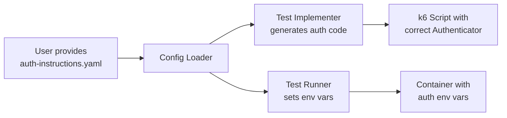

# WP-12j — Auth Instructions Framework

> **Status**: Draft · **Parent**: [WP-12](wp-12-ai-agent-test-automation.md)
> · **Depends on**: WP-12a

## Goal

Create a framework for users to provide **authentication instructions** that
agents follow when generating and running tests. Every company has unique
auth flows (JWT login, OAuth2 client credentials, API keys, mTLS, etc.)
and this must be configurable — never hardcoded.

## Problem

- JWT token endpoints differ per service (URL, payload shape, token field).
- OAuth2 flows require client IDs, secrets, scopes, and token URLs.
- Some services use API keys in headers, others in query parameters.
- mTLS requires certificates that are company-specific.
- The agents cannot know these details — the user must provide them.

## Scope

- [ ] Define a **YAML schema** for auth instructions.
- [ ] Support all auth types already in `src/clients/http-auth.js`:
      Basic, Bearer, JWT, API Key, OAuth2 Client Credentials.
- [ ] Auth instructions are loaded by the config loader (WP-12a).
- [ ] Test Implementer uses auth instructions to generate correct
      auth setup in k6 scripts.
- [ ] Test Runner passes auth-related environment variables to containers.
- [ ] Secrets are referenced by environment variable name, never stored
      in the instruction file.

## Auth Instructions Schema

```yaml
# auth-instructions.yaml
auth:
  type: jwt  # basic | bearer | jwt | api-key | oauth2
  jwt:
    loginUrl: "https://api.example.com/auth/login"
    method: POST
    payload:
      username: "${JWT_USERNAME}"     # env var reference
      password: "${JWT_PASSWORD}"     # env var reference
    tokenField: "access_token"       # field in response JSON
    tokenPrefix: "Bearer"            # prefix for Authorization header
    refreshUrl: "https://api.example.com/auth/refresh"  # optional

  # Alternative: OAuth2
  oauth2:
    tokenUrl: "https://auth.example.com/oauth/token"
    clientId: "${OAUTH2_CLIENT_ID}"
    clientSecret: "${OAUTH2_CLIENT_SECRET}"
    scope: "read write"

  # Alternative: API Key
  apiKey:
    header: "X-API-Key"
    value: "${API_KEY}"

  # Alternative: Basic
  basic:
    username: "${API_USERNAME}"
    password: "${API_PASSWORD}"
```

## How Agents Use Auth Instructions



The Test Implementer generates code like:

```javascript
import { Authenticator } from '../src/clients/http-auth.js';

const auth = new Authenticator();
const token = auth.getJwtAuth();
```

The Test Runner sets the environment variables referenced in the YAML.

## Definition of Done

- [ ] YAML schema defined and documented.
- [ ] Config loader parses auth instructions and resolves env var references.
- [ ] Test Implementer generates correct auth code for each auth type.
- [ ] Test Runner passes correct env vars to containers.
- [ ] Unit tests cover all auth types.
- [ ] Integration test: JWT auth flow end-to-end with a mock login endpoint.
- [ ] `go test ./auth-instructions/...` passes.
