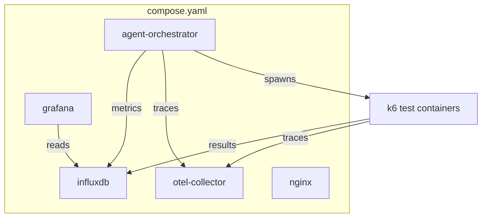

# WP-12k — End-to-End Integration & Deployment

> **Status**: Draft · **Parent**: [WP-12](wp-12-ai-agent-test-automation.md)
> · **Depends on**: All WP-12a through WP-12j

## Goal

Wire all agents together into a single deployable system, add a Dockerfile,
update CI, and run an end-to-end demo.

## Scope

### Integration

- [ ] Orchestrator calls all agents in sequence via the message bus.
- [ ] All MCP server connections work with real services.
- [ ] Auth instructions flow through the entire pipeline.
- [ ] Final report links every user story to pass/fail results.

### Container Build

- [ ] Create `agents/Dockerfile` that builds the Go binary.
- [ ] Add `agents/` service to `compose.yaml`.
- [ ] Ensure the agent container can communicate with existing services
      (InfluxDB, Grafana, OTel collector, Nginx).

### CI Updates

- [ ] Add Go build step to `ci.yml`.
- [ ] Add `go test ./...` to CI.
- [ ] Add `golangci-lint` to CI.
- [ ] Add integration tests with clear boundaries:
  - Orchestrator state transitions (mock agents).
  - Agent dispatch sequence (correct order verified).
  - Mock API response handling (stub HTTP server).
  - Report generation from synthetic results.

### Demo

- [ ] Create a sample `demo/` directory with:
  - Sample user stories (markdown).
  - Sample OpenAPI spec (JSON).
  - Sample auth instructions (YAML).
  - Sample HAR recording (optional).
- [ ] Run the demo end-to-end and produce a report.
- [ ] Document the demo steps in `docs/`.

## Deployment Diagram

## Definition of Done

- [ ] End-to-end pipeline runs: user story in → k6 test executed → report out.
- [ ] `agents/Dockerfile` builds and runs.
- [ ] CI passes with Go build, test, and lint.
- [ ] Demo documented and reproducible.
- [ ] `compose.yaml` updated with agent service.
- [ ] Documentation updated in `docs/`.
